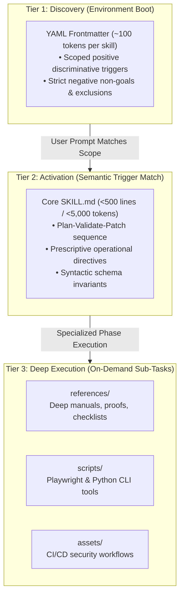

# Production Agent Skills

[](LICENSE)
[](CONTRIBUTING.md)
[](.github/workflows/validate-skills.yml)
[](install.sh)

A curated suite of high-reliability, deterministic **Agent Skills** conforming to the **Agent Skills Open Standard**. These skills constrain autonomous AI coding agents during full-stack web development, replacing subjective narrative advice with prescriptive syntactic constraints, three-tier progressive disclosure, and automated verification gates.

---

## ⚡ Quickstart (1-Line Installation)

Install all 5 skills globally into your agent configuration:

```bash
curl -fsSL https://raw.githubusercontent.com/Sathyabalan6/production-agent-skills/main/install.sh | bash
```

Or clone and install locally:

```bash
git clone https://github.com/Sathyabalan6/production-agent-skills.git
cd production-agent-skills

# Install globally to Google Antigravity (default: ~/.gemini/config/skills/)
./install.sh

# Or install to Claude Code (~/.claude/skills/)
./install.sh --target claude

# Or install to Cursor (~/.cursor/skills/)
./install.sh --target cursor

# Or install locally into current project (.agents/skills/)
./install.sh --target local
```

*Windows users can run `python scripts/install.py --target <antigravity|claude|cursor|local>`.*

---

## 📦 Skills Catalog

| Skill Name | Scope & Operational Focus | Deterministic Gates & Tools |
| :--- | :--- | :--- |
| **[`ai-website-polish`](ai-website-polish/SKILL.md)** | Audits vibe-coded apps for launch readiness: WCAG 2.2 AA (SC 2.4.11, 2.5.8, 3.3.8, 2.5.7), INP long-task chunking, and mobile viewport constraints. | Playwright + `@axe-core/playwright` (`scripts/a11y-audit.spec.ts`) |
| **[`website-data-protection`](website-data-protection/SKILL.md)** | Eliminates Server Action BOLA/IDOR, configures dynamic nonce-based CSP (`'strict-dynamic'`), and protects against AI-hallucinated packages. | Semgrep rulesets & Slopsquat CI manifest scanning |
| **[`quantitative-ux-engine`](quantitative-ux-engine/SKILL.md)** | Computes decision entropy ($T = b \log_2(n+1)$), Fitts's movement time, WCAG centroid geometry, and iteration degradation rates ($r \approx 6.59\%$). | Python CLI calculation engine (`scripts/ux-metrics.py`) |
| **[`ux-laws-for-ai-design`](ux-laws-for-ai-design/SKILL.md)** | Translates cognitive psychology heuristics into layout constraints: $\le 5$ top-level choices, $\ge 48\text{px}$ CTAs, $3\text{–}7$ item clusters. | Parametric layout engine & mandatory 3-part response contract |
| **[`frontend-math-precision`](frontend-math-precision/SKILL.md)** | Replaces magic numbers with CSS-native trigonometry (`sin`, `cos`, `atan2`), fluid `clamp()`, `linear()` easing, and container query units. | Browser Baseline support checks and reduced-motion fallbacks |

---

## 🏛 Three-Tier Progressive Disclosure Architecture

Unguided agents modifying code frequently drop defensive validation and accessibility attributes to satisfy immediate prompts—compounding critical defects by $\approx 37.6\%$ over 5 rounds ($r \approx 6.59\%$ per iteration). 

This repository halts iteration decay by strictly segregating context into three distinct operational tiers:



1. **Tier 1: Discovery**: Only name, compatibility, and scoped descriptions are loaded at agent startup, consuming a negligible footprint.
2. **Tier 2: Activation**: The host agent loads the concise `SKILL.md` body ($<500$ lines) only when triggered, preserving $>90\%$ of active model reasoning capacity.
3. **Tier 3: Deep Execution**: Extended checklists (`references/`), verification scripts (`scripts/`), and workflows (`assets/`) load strictly on demand.

---

## 🧪 Automated Conformance Testing

Every skill in this repository is tested against the Agent Skills Open Standard before merge:

```bash
# Run the validation suite locally
python3 scripts/validate-skills.py
```

The validation suite enforces:
- Directory name matches frontmatter `name` ($\le 64$ characters).
- Description is $\le 1024$ characters and includes explicit negative triggers.
- Core `SKILL.md` strictly adheres to the $<500$-line token envelope.
- Bundled verification scripts execute cleanly with zero errors.

---

## 🤝 Contributing

Contributions of new production-grade skills and hardening updates are welcome! Please read our [Contributing Guide](CONTRIBUTING.md) and [Code of Conduct](CODE_OF_CONDUCT.md) before submitting a Pull Request.

---

## 📄 License

This repository is licensed under the permissive [MIT License](LICENSE).
